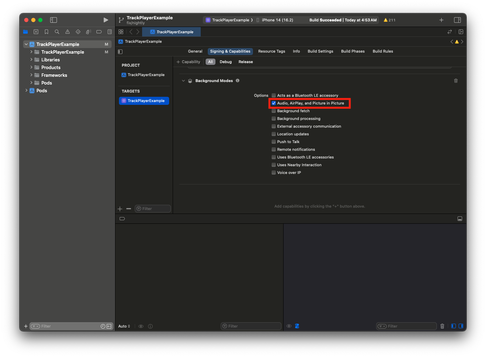

# Background Mode

React Native Track Player supports playing audio while your app is in the
background on all supported platforms.

## Android
Background audio playback works right out of the box. By default, the audio will
continue to play, not only when the app is suspended in the background, but also
after the app is closed by the user. If that is not the desired behavior, you
can disable it with the `android.appKilledPlaybackBehavior` property in
`updateOptions`.

In this case, the audio will still play while the app is open in the background.:

```js
TrackPlayer.updateOptions({
    android: {
        // This is the default behavior
        appKilledPlaybackBehavior: AppKilledPlaybackBehavior.ContinuePlayback
    },
    ...
});
```

Please look at the [`AppKilledPlaybackBehavior`](../api/constants/app-killed-playback-behavior.md)
documentation for all the possible settings and how they behave.

Please note that while your app is in background, your UI might be unmounted by
React Native. Event listeners added in the [playback service](./playback-service.md)
will continue to receive events.

### Notification

The notification will only be visible if the following are true:

- `AppKilledPlaybackBehavior.ContinuePlayback` or `AppKilledPlaybackBehavior.PausePlayback` are selected.
- Android has not killed the playback service due to no memory, crash, or other issue.

Your app will be opened when the notification is tapped. You can implement a
custom initialization (e.g.: opening directly the player UI) by using the
[Linking API](https://reactnative.dev/docs/linking) looking for the
`trackplayer://notification.click` URI.

## iOS

In order to continue playing audio in the background (e.g. via a lockscreen or
when the app has been backgrounded), you'll need to enable the
`Audio, AirPlay, and Picture in Picture` Capability in your project. Without
activating it, the audio will only play when the app is in the foreground. This
can be added via the "Capability" option on the "Signing & Capabilities" tab:

1. Click on the "+ Capabilities" button.
2. Search for and select "Background Modes".


Once selected, the Capability will be shown below the other enabled
capabilities. If no option appears when searching, the capability may already
be enabled.

Now ensure that both the `Audio, AirPlay, and Picture in Picture` sub-modes are
enabled:



### iOS Simulator
As of iOS Simulator version 11, Apple has removed support for Control Center and
Now Playing Info from the simulator. You will not be able to test lock screen
controls on recent versions of iOS Simulator. You can either test on real
devices, or download older versions of the iOS Simulator.
